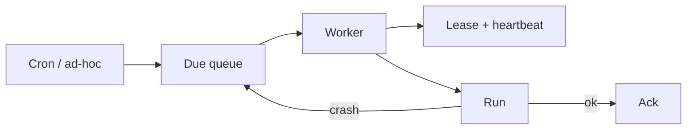

# lease

```mermaid
flowchart LR
  cron[Cron / ad-hoc] --> q[Due queue]
  q --> worker[Worker]
  worker --> lease[Lease + heartbeat]
  worker --> run[Run]
  run -->|ok| done[Ack]
  run -->|crash| q
```
