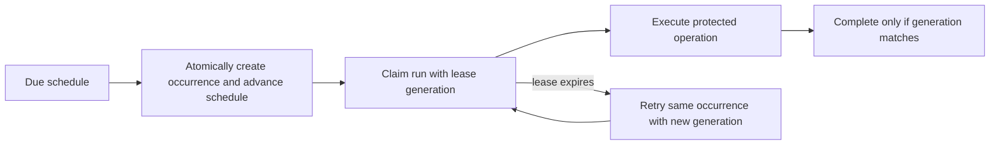

# lease

```mermaid
flowchart LR
  cron[Due schedule] --> tx[Atomically create occurrence and advance schedule]
  tx --> claim[Claim run with lease generation]
  claim --> run[Execute protected operation]
  run --> done[Complete only if generation matches]
  claim -->|lease expires| retry[Retry same occurrence with new generation]
  retry --> claim
```
