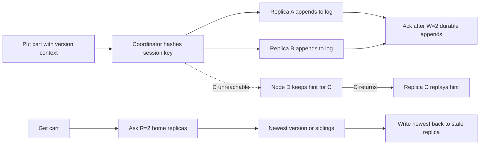

# quorum

```mermaid
flowchart LR
  put[Put cart with version context] --> coord[Coordinator hashes session key]
  coord --> ra[Replica A appends to log]
  coord --> rb[Replica B appends to log]
  coord -.->|C unreachable| hint[Node D keeps hint for C]
  ra --> ack[Ack after W=2 durable appends]
  rb --> ack
  hint -->|C returns| rc[Replica C replays hint]
  get[Get cart] --> read[Ask R=2 home replicas]
  read --> merge[Newest version or siblings]
  merge --> repair[Write newest back to stale replica]
```
