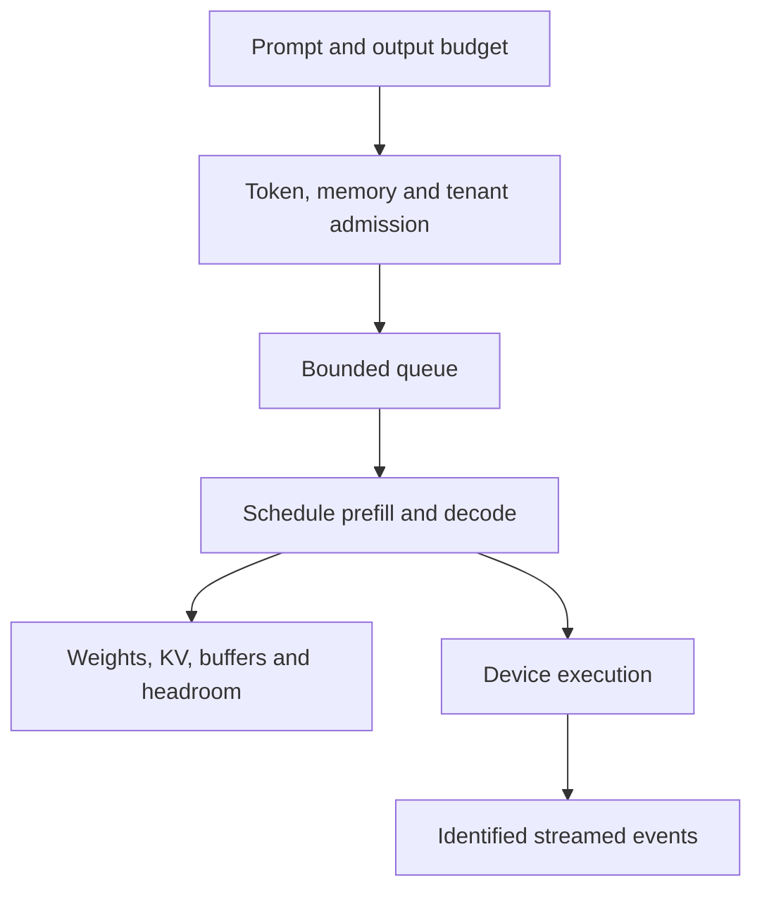

# batch

```mermaid
flowchart TB
  req[Prompt and output budget] --> admit[Token, memory and tenant admission]
  admit --> q[Bounded queue]
  q --> batch[Schedule prefill and decode]
  batch --> memory[Weights, KV, buffers and headroom]
  batch --> gpu[Device execution]
  gpu --> tok[Identified streamed events]
```
