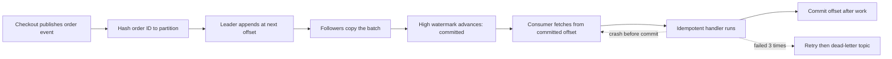

# offsets

```mermaid
flowchart LR
  prod[Checkout publishes order event] --> part[Hash order ID to partition]
  part --> lead[Leader appends at next offset]
  lead --> foll[Followers copy the batch]
  foll --> hw[High watermark advances: committed]
  hw --> fetch[Consumer fetches from committed offset]
  fetch --> work[Idempotent handler runs]
  work --> commit[Commit offset after work]
  work -.->|crash before commit| fetch
  work -.->|failed 3 times| dlq[Retry then dead-letter topic]
```
