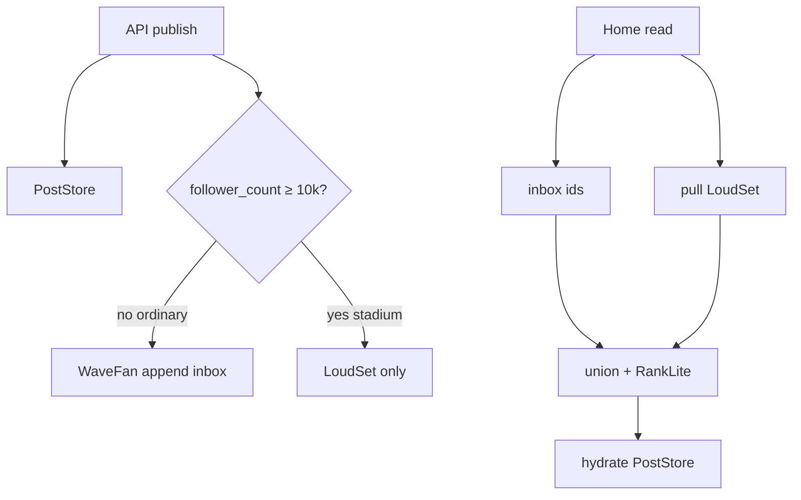

# Hybrid fanout

```mermaid
flowchart TB
  api[API publish] --> post[PostStore]
  api --> wave{follower_count ≥ 10k?}
  wave -->|no ordinary| fan[WaveFan append inbox]
  wave -->|yes stadium| loud[LoudSet only]
  home[Home read] --> inbox[inbox ids]
  home --> pull[pull LoudSet]
  inbox --> merge[union + RankLite]
  pull --> merge
  merge --> body[hydrate PostStore]
```
