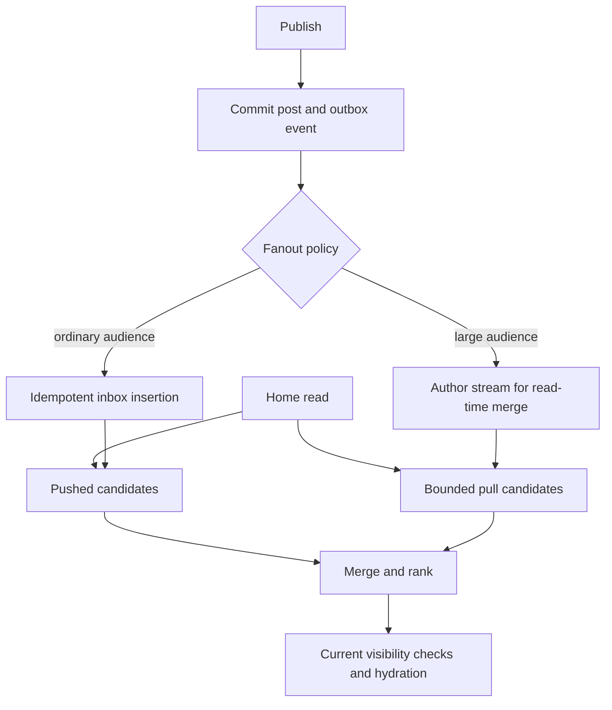

# hybrid

```mermaid
flowchart TB
  api[Publish] --> post[Commit post and outbox event]
  post --> wave{Fanout policy}
  wave -->|ordinary audience| fan[Idempotent inbox insertion]
  wave -->|large audience| pullstore[Author stream for read-time merge]
  home[Home read] --> inbox[Pushed candidates]
  home --> pull[Bounded pull candidates]
  fan --> inbox
  pullstore --> pull
  inbox --> merge[Merge and rank]
  pull --> merge
  merge --> auth[Current visibility checks and hydration]
```
