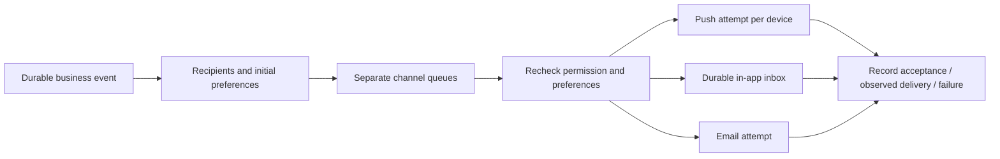

# channels

```mermaid
flowchart LR
  event[Durable business event] --> pref[Recipients and initial preferences]
  pref --> q[Separate channel queues]
  q --> check[Recheck permission and preferences]
  check --> push[Push attempt per device]
  check --> inbox[Durable in-app inbox]
  check --> email[Email attempt]
  push --> state[Record acceptance / observed delivery / failure]
  inbox --> state
  email --> state
```
