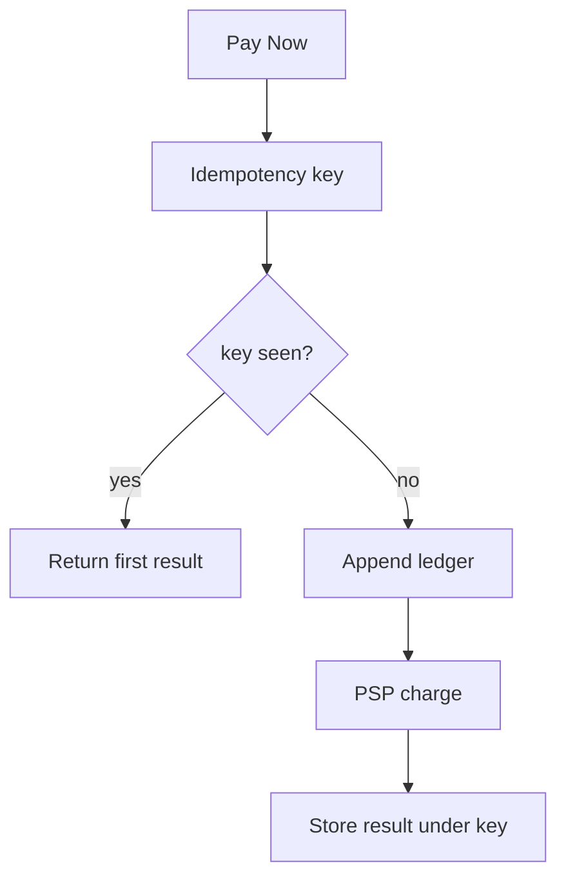

# keys

```mermaid
flowchart TB
  tap[Pay Now] --> key[Idempotency key]
  key --> seen{key seen?}
  seen -->|yes| replay[Return first result]
  seen -->|no| ledger[Append ledger]
  ledger --> psp[PSP charge]
  psp --> store[Store result under key]
```
