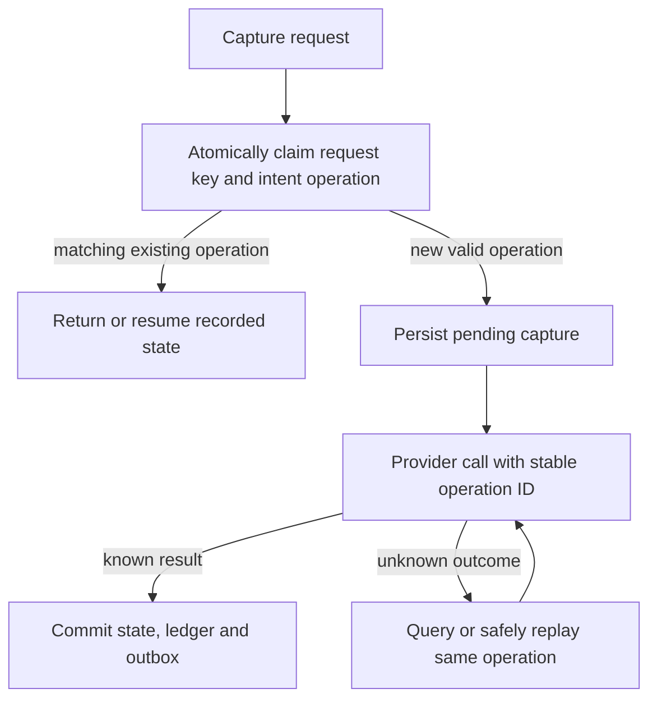

# keys

```mermaid
flowchart TB
  req[Capture request] --> claim[Atomically claim request key and intent operation]
  claim -->|matching existing operation| replay[Return or resume recorded state]
  claim -->|new valid operation| pending[Persist pending capture]
  pending --> psp[Provider call with stable operation ID]
  psp -->|known result| commit[Commit state, ledger and outbox]
  psp -->|unknown outcome| reconcile[Query or safely replay same operation]
  reconcile --> psp
```
