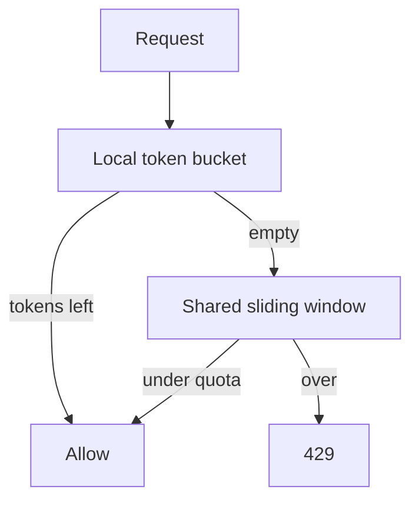

# bucket

```mermaid
flowchart TB
  req[Request] --> local[Local token bucket]
  local -->|tokens left| pass[Allow]
  local -->|empty| redis[Shared sliding window]
  redis -->|under quota| pass
  redis -->|over| shed[429]
```
