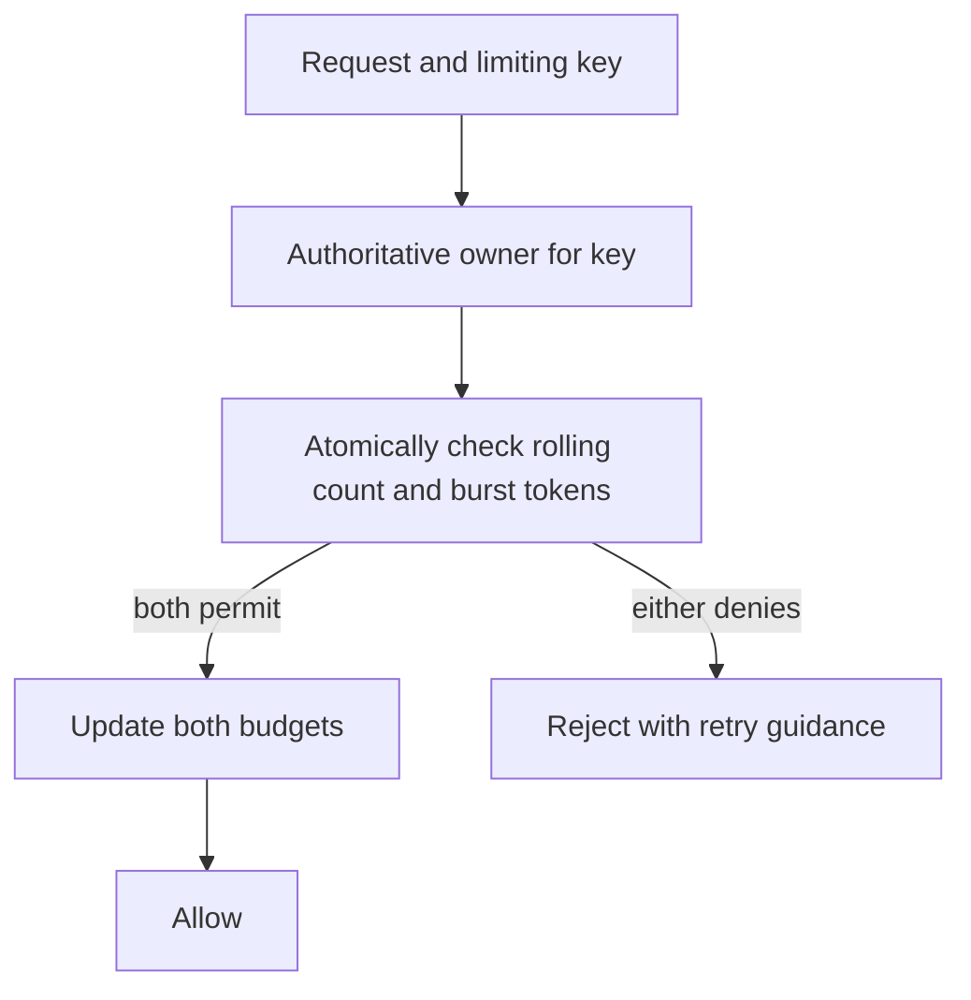

# bucket

```mermaid
flowchart TB
  req[Request and limiting key] --> owner[Authoritative owner for key]
  owner --> check[Atomically check rolling count and burst tokens]
  check -->|both permit| consume[Update both budgets]
  consume --> pass[Allow]
  check -->|either denies| shed[Reject with retry guidance]
```
