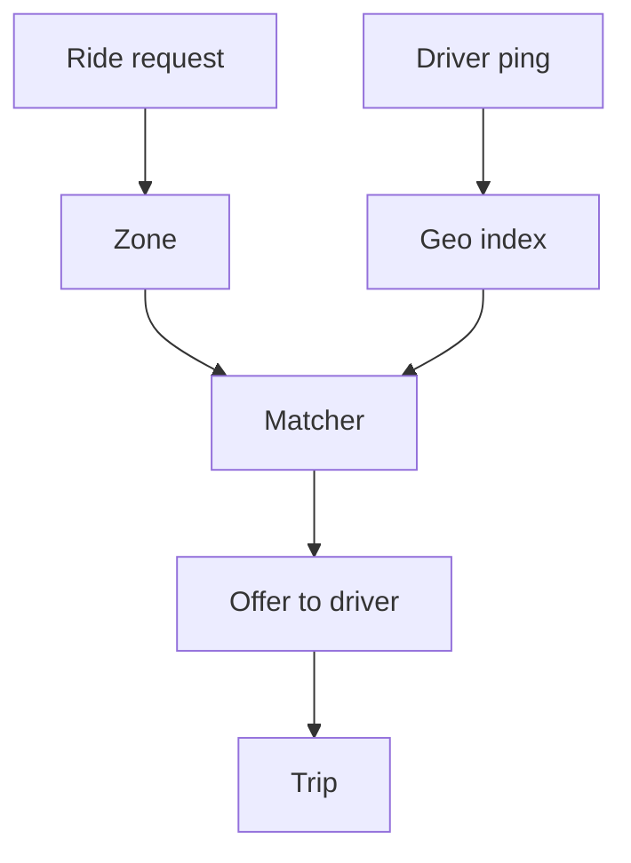

# match

```mermaid
flowchart TB
  ping[Driver ping] --> geo[Geo index]
  ride[Ride request] --> zone[Zone]
  zone --> match[Matcher]
  geo --> match
  match --> offer[Offer to driver]
  offer --> trip[Trip]
```
