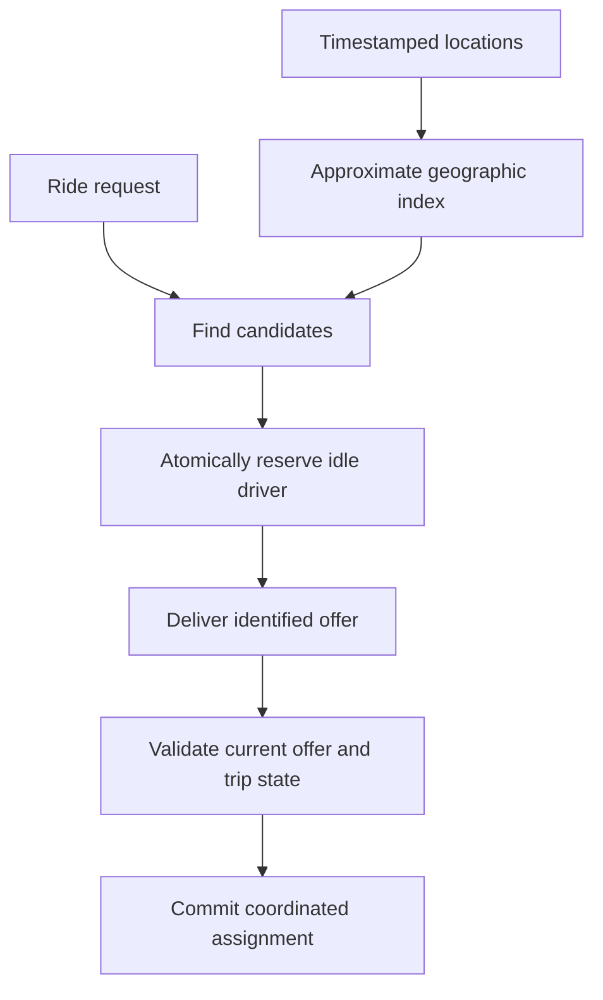

# match

```mermaid
flowchart TB
  ping[Timestamped locations] --> geo[Approximate geographic index]
  ride[Ride request] --> match[Find candidates]
  geo --> match
  match --> reserve[Atomically reserve idle driver]
  reserve --> offer[Deliver identified offer]
  offer --> accept[Validate current offer and trip state]
  accept --> trip[Commit coordinated assignment]
```
