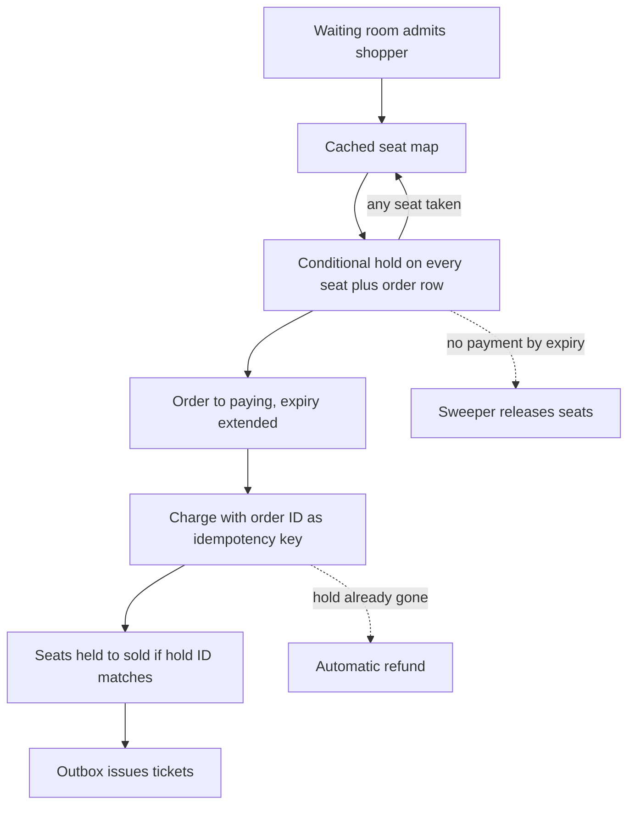

# hold

```mermaid
flowchart TB
  wait[Waiting room admits shopper] --> map[Cached seat map]
  map --> hold[Conditional hold on every seat plus order row]
  hold -->|any seat taken| map
  hold --> pay[Order to paying, expiry extended]
  pay --> charge[Charge with order ID as idempotency key]
  charge --> confirm[Seats held to sold if hold ID matches]
  confirm --> ticket[Outbox issues tickets]
  hold -.->|no payment by expiry| release[Sweeper releases seats]
  charge -.->|hold already gone| refund[Automatic refund]
```
