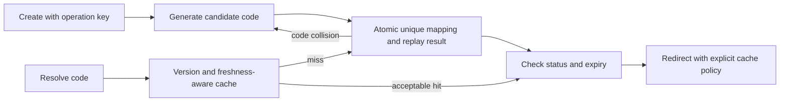

# path

```mermaid
flowchart LR
  mint[Create with operation key] --> keys[Generate candidate code]
  keys --> store[Atomic unique mapping and replay result]
  store -->|code collision| keys
  click[Resolve code] --> cache[Version and freshness-aware cache]
  cache -->|miss| store
  store --> check[Check status and expiry]
  cache -->|acceptable hit| check
  check --> redirect[Redirect with explicit cache policy]
```
