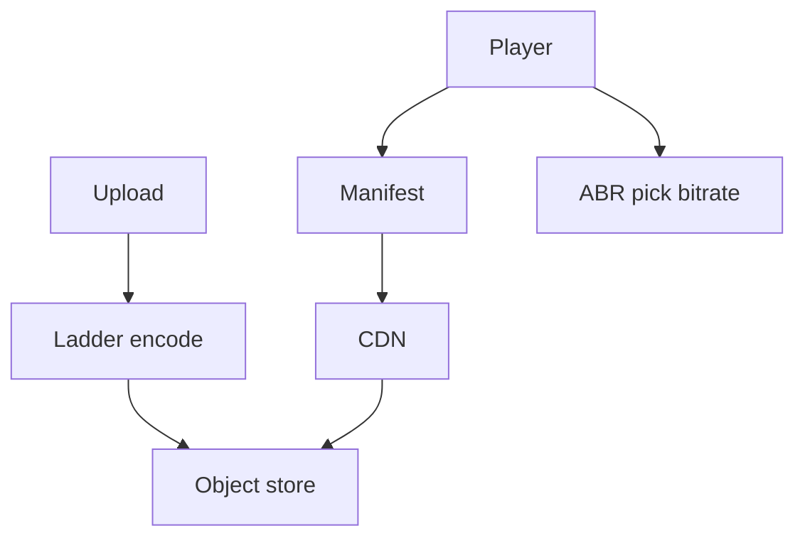

# abr

```mermaid
flowchart TB
  upload[Upload] --> encode[Ladder encode]
  encode --> obj[Object store]
  play[Player] --> man[Manifest]
  man --> cdn[CDN]
  cdn --> obj
  play --> abr[ABR pick bitrate]
```
