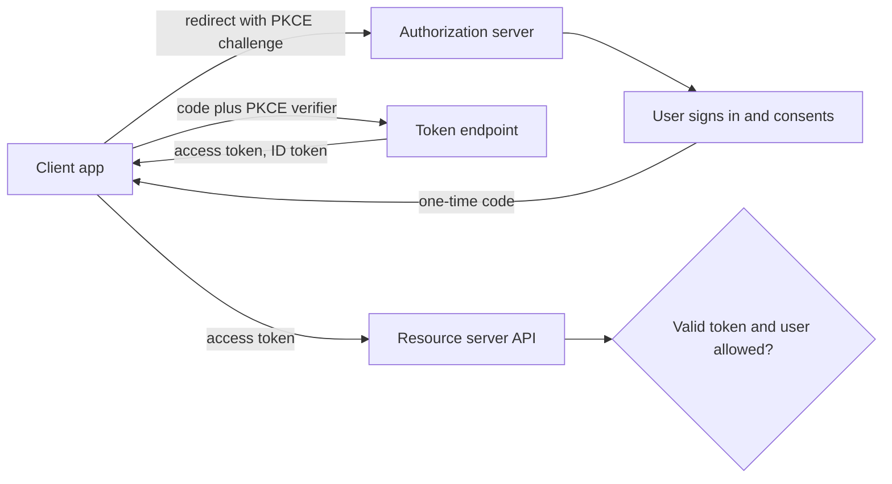

# code-flow

```mermaid
flowchart LR
  app[Client app] -->|redirect with PKCE challenge| authz[Authorization server]
  authz --> login[User signs in and consents]
  login -->|one-time code| app
  app -->|code plus PKCE verifier| tokens[Token endpoint]
  tokens -->|access token, ID token| app
  app -->|access token| api[Resource server API]
  api --> check{Valid token and user allowed?}
```
