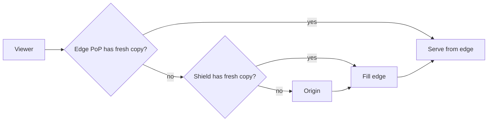

# shield

```mermaid
flowchart LR
  user[Viewer] --> edge{Edge PoP has fresh copy?}
  edge -->|yes| serve[Serve from edge]
  edge -->|no| shield{Shield has fresh copy?}
  shield -->|yes| fill[Fill edge]
  shield -->|no| origin[Origin]
  origin --> fill
  fill --> serve
```
