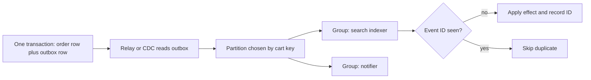

# outbox

```mermaid
flowchart LR
  tx[One transaction: order row plus outbox row] --> relay[Relay or CDC reads outbox]
  relay --> part[Partition chosen by cart key]
  part --> groupA[Group: search indexer]
  part --> groupB[Group: notifier]
  groupA --> dedupe{Event ID seen?}
  dedupe -->|no| apply[Apply effect and record ID]
  dedupe -->|yes| skip[Skip duplicate]
```
