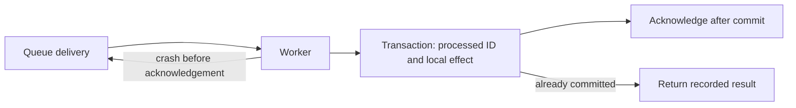

# once

```mermaid
flowchart LR
  q[Queue delivery] --> work[Worker]
  work --> tx[Transaction: processed ID and local effect]
  tx --> ack[Acknowledge after commit]
  work -->|crash before acknowledgement| q
  tx -->|already committed| result[Return recorded result]
```
