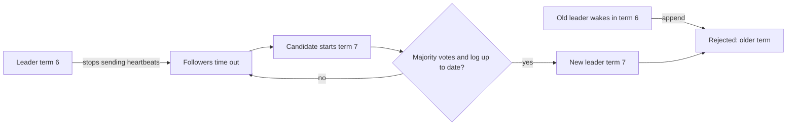

# failover

```mermaid
flowchart LR
  lead[Leader term 6] -->|stops sending heartbeats| miss[Followers time out]
  miss --> cand[Candidate starts term 7]
  cand --> vote{Majority votes and log up to date?}
  vote -->|no| miss
  vote -->|yes| newl[New leader term 7]
  stale[Old leader wakes in term 6] -->|append| reject[Rejected: older term]
  newl --> reject
```
