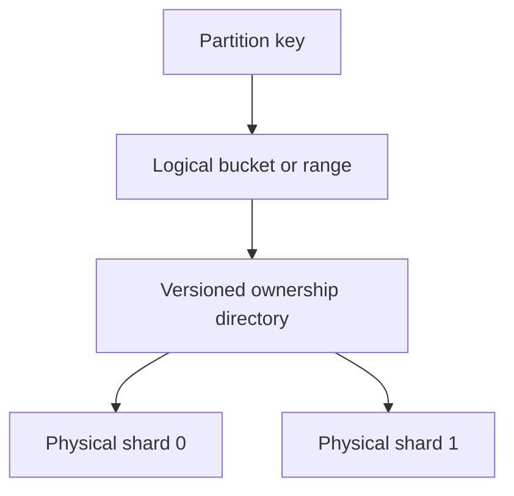

# keyspace

```mermaid
flowchart TB
  key[Partition key] --> bucket[Logical bucket or range]
  bucket --> directory[Versioned ownership directory]
  directory --> s0[Physical shard 0]
  directory --> s1[Physical shard 1]
```
