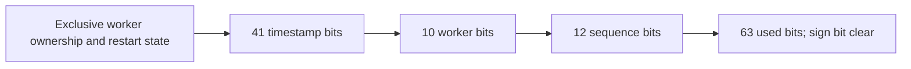

# bits

```mermaid
flowchart LR
  owner[Exclusive worker ownership and restart state] --> time[41 timestamp bits]
  time --> worker[10 worker bits]
  worker --> seq[12 sequence bits]
  seq --> id[63 used bits; sign bit clear]
```
